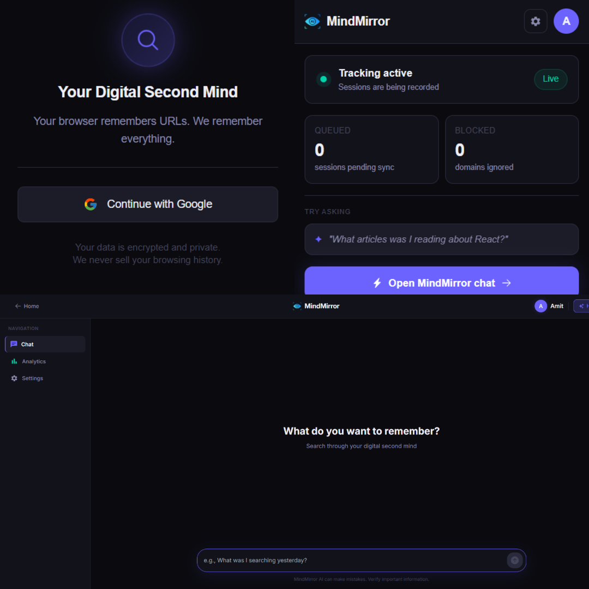

<!-- Add your banner/cover image here. See "Adding the image" instructions at the bottom of this file. -->
<p align="center">
  
</p>

<h1 align="center">MindMirror</h1>
<p align="center"><b>Your Digital Second Mind</b></p>
<p align="center">A privacy-first Chrome extension that turns your browsing history into a conversational, searchable memory.</p>

<p align="center">
  
  
  
  
  
  
</p>

---

## Overview

MindMirror replaces your browser's new tab page with a **second mind** for your browsing life. It quietly records the pages you visit — encrypted, per-user — and lets you *talk* to that history instead of digging through `chrome://history`.

Ask things like:

- *"What was that pricing page I looked at last week for the CRM tool?"*
- *"Summarize everything I read about vector databases this month."*
- *"How much time did I spend on YouTube today?"*

An agent built with **LangGraph** decides whether to search your encrypted browsing sessions, fall back to a live web search via **Tavily**, or both — then replies with a structured, conversational answer, citing the exact pages it used.

## How it works

```
Browser Activity
      │
      ▼
Chrome Extension (Manifest V3)
  ├─ content.js / background.js → capture tab sessions (url, title, domain, time spent)
      │
      ▼
Node/Express API  ──►  MongoDB (AES-256-GCM encrypted per-user)
      │
      ▼
User asks a question in the New Tab chat UI
      │
      ▼
FastAPI + LangGraph Agent (GPT-4o-mini)
  ├─ Checks user's "ignored domains" privacy preferences
  ├─ Tool: search_browsing_history → queries & decrypts MongoDB sessions
  ├─ Tool: tavily_search → web search fallback for extra context
  └─ Structured response with answer, sources, suggestions, follow-ups
      │
      ▼
Conversational answer rendered in the New Tab
```

## Features

- 🧠 **Conversational memory** — query your own browsing history in natural language via a LangGraph agent.
- 🔐 **Per-user encryption** — session content is encrypted with AES-256-GCM using a key derived per user (shared derivation logic between the Node and FastAPI services).
- 🕵️ **Privacy controls** — users can define "ignored domains/patterns" that MindMirror will never track or answer questions about.
- 🔎 **Hybrid search** — the agent first searches your own history, and only falls back to a live Tavily web search when your history doesn't have enough context.
- 🛡️ **Sensitive-data masking** — passwords, OTPs, card numbers, IDs, and other credentials are automatically stripped from AI responses even if present in captured page text.
- 📊 **Analytics dashboard** — visual breakdown of time spent and domains visited (today / week / month / year).
- 🆕 **New tab takeover** — chat, analytics, and settings live directly on your new tab page.
- 🔑 **Google Sign-In** — auth via Chrome Identity + Google OAuth.

## Tech stack

| Layer | Stack |
|---|---|
| Extension / Frontend | React 19, Vite, Redux Toolkit, Tailwind CSS, Chrome Manifest V3 |
| Core API | Node.js, Express 5, MongoDB (Mongoose), JWT auth, Nodemailer |
| AI Service | FastAPI, LangGraph, LangChain, OpenAI (`gpt-4o-mini`), Tavily, Motor (async MongoDB) |
| Data & Security | MongoDB, AES-256-GCM encryption (HMAC-derived per-user keys) |

## Project structure

```
MindMirror/
├── frontend/                # Chrome extension (React + Vite)
│   ├── public/manifest.json # MV3 manifest
│   └── src/
│       ├── background/      # Service worker, session tracking
│       ├── content/         # Content script injected into pages
│       ├── newTab/          # New tab app — chat, analytics, settings
│       ├── popup/           # Extension toolbar popup
│       └── shared/          # Store, API client, Firebase utils
│
├── backend-node/            # Core REST API
│   ├── controllers/         # auth, user, sessions, analytics
│   ├── models/               # User & Session (MongoDB) schemas
│   ├── routes/               # /api/auth, /api/user, /api/extension
│   └── utils/                # encryption, mailer, JWT helpers
│
└── backend-fastapi/         # AI / conversational agent service
    ├── graph/
    │   ├── graph_builder.py # LangGraph workflow definition
    │   ├── nodes.py         # Ignore-check, prompt, chat, response nodes
    │   ├── prompt.py        # System prompt builder
    │   └── tools/           # search_browsing_history, tavily_search
    ├── routes/ & controllers/
    └── utils/                # database, encryption
```

## Getting started

### Prerequisites

- Node.js 18+
- Python 3.11+ (with [uv](https://docs.astral.sh/uv/) recommended)
- MongoDB instance (local or Atlas)
- OpenAI API key, Tavily API key
- A Google Cloud OAuth Client ID (for `chrome.identity`)

### 1. Clone the repo

```bash
git clone https://github.com/Amit140205/MindMirror---Your-Digital-Second-Mind.git
cd MindMirror---Your-Digital-Second-Mind
```

### 2. Core API (`backend-node`)

```bash
cd backend-node
npm install
```

Create a `.env` file:

```env
PORT=3000
MONGO_URI=your_mongodb_connection_string
JWT_SECRET=your_jwt_secret
ENCRYPTION_SECRET=your_shared_encryption_secret
GMAIL_USER=your_gmail_address
GMAIL_APP_PASSWORD=your_gmail_app_password
EXTENSION_ID=your_chrome_extension_id
```

```bash
npm run dev
```

### 3. AI Service (`backend-fastapi`)

```bash
cd backend-fastapi
uv sync   # or: pip install -e .
```

Create a `.env` file:

```env
MONGO_URI=your_mongodb_connection_string
ENCRYPTION_SECRET=your_shared_encryption_secret   # must match backend-node
OPENAI_API_KEY=your_openai_api_key
TAVILY_API_KEY=your_tavily_api_key
```

```bash
uvicorn server:app --reload --port 8000
```

### 4. Extension (`frontend`)

```bash
cd frontend
npm install
npm run build
```

Then load it into Chrome:

1. Go to `chrome://extensions`
2. Enable **Developer mode**
3. Click **Load unpacked** and select the `frontend/dist` folder
4. Open a new tab — MindMirror should load in place of the default new tab page

## Privacy & security

- Browsing session content is **encrypted at rest** with AES-256-GCM, using a key derived per user via HMAC-SHA256 — the same derivation logic is shared between the Node and FastAPI services so either can decrypt only what belongs to that user.
- Users can mark specific domains as **ignored**; the agent checks this list before answering and will decline to discuss those domains.
- The AI response layer actively **redacts sensitive data** (passwords, OTPs, card numbers, government IDs, API keys) even if such data was inadvertently captured in page text.

## Author

Built by [Amit](https://github.com/Amit140205) as a final year project.

---
